# Career Dendrogram Project
**A Career Guidance Application for Students**

## Overview

Career Dendrogram is an advanced Django web application designed to help students explore and visualize various career paths. By leveraging the power of hierarchical data structures, the application displays career roles and paths in a dynamic, interactive dendrogram. Users can easily manage their profiles, interact with career paths, and discover potential professional journeys.

## Features

- **User Account Management**: 
   - Secure user authentication (registration, login, password recovery)
   - Profile creation and editing (personal information, career interests)
  
- **Career Path Management**: 
   - Full CRUD operations for managing career paths and roles
   - Ability to categorize careers based on industry, skill sets, education, and more
  
- **Dendrogram Visualization**: 
   - Visual representation of career paths and role hierarchies in a dendrogram format
   - Interactive filtering and zooming for better exploration of paths

- **Responsive UI/UX**: 
   - Mobile-first design for accessibility across devices
   - Interactive UI with real-time updates and animations

- **Advanced Search and Filtering**: 
   - Search career paths by keywords, industries, skillsets, or education
   - Apply filters to narrow down career options based on user preferences

## Installation

Follow these steps to set up the Career Dendrogram project locally:


## Installation

1. **Clone the repository:**

   ```bash
   git clone https://github.com/01Prathamesh/Career_Dendrogram_Project.git
   cd Career_Dendrogram_Project

2. **Create a virtual environment:**

   ```bash
    python -m venv venv
    source venv/bin/activate  # On Windows use `venv\Scripts\activate`

3. **Install the required packages:**

   ```bash
    pip install -r requirements.txt

4. **Create a .env file:**
In the root of your project, create a .env file and add the following environment variables:
   ```bash
   NEWS_API_KEY="Your_News_API_Key"
   DJANGO_SECRET_KEY='your-secret-key'
   DJANGO_DEBUG=True
   DJANGO_ALLOWED_HOSTS='127.0.0.1,localhost'
   DJANGO_DB_ENGINE='django.db.backends.sqlite3'
   DJANGO_DB_NAME='db.sqlite3'
   ```
- Replace 'your-secret-key' with a secret key for your Django application (you can generate one using Django’s django.core.management.utils.get_random_secret_key() function).And 

5. **Run migrations:**

   ```bash
   python manage.py migrate

6. **Run the development server:**

   ```bash
   python manage.py runserver

7. **Access the application:**

    Open your web browser and navigate to http://127.0.0.1:8000/.


## Usage

- **User Registration**: Navigate to the registration page and create an account to get started.
- **Profile Management**: Once logged in, users can access their profiles to update personal information and career preferences.
- **Manage Career Paths**: Administrators and users with proper permissions can create, edit, or delete career paths and roles.
- **Dendrogram Visualization**: Explore career paths visually by viewing an interactive dendrogram that shows career role hierarchies, growth potential, and educational requirements.

## Technologies Used

This project uses a combination of cutting-edge technologies:

- **Backend**:
    - **Django**: A robust Python-based web framework to handle the backend logic and API.
    - **SQLite**: Default lightweight database used for development. You can configure a production database like PostgreSQL or MySQL.
  
- **Frontend**:
    - **HTML5/CSS3**: For the basic structure and styling of the web pages.
    - **JavaScript (D3.js)**: D3.js is used to create the interactive dendrogram visualization that dynamically presents the career paths.
  
- **Authentication**:
    - **Django Allauth**: For advanced authentication features such as login, registration, and password management.

- **Data Visualization**:
    - **D3.js**: A powerful JavaScript library to create dynamic, interactive data visualizations, used here for the dendrogram.

## Contributing

We welcome contributions to improve Career Dendrogram! To contribute:

1. Fork the repository.
2. Create a new branch for your changes.
3. Implement your changes and ensure they are thoroughly tested.
4. Submit a pull request with a clear description of what your changes do.

## License

This project is licensed under the MIT License. For more details, see the [LICENSE](LICENSE.txt) file.

## Code of Conduct

Guidelines and standards for contributing to and interacting with the community [Code of Conduct](CODE_OF_CONDUCT.md).

## Security

Information on supported versions and how to report vulnerabilities.
[Security Policy](SECURITY.md)

## Acknowledgments

- Special thanks to the **Django community** for providing such a reliable and flexible framework.
- Inspiration and ideas have been taken from various **career guidance platforms** and **visualization tools** that help individuals make informed career decisions.

## Future Enhancements

The Career Dendrogram project is continuously evolving. Future improvements may include:

- **AI-powered Career Suggestions**: Personalized career recommendations based on users' skills, interests, and educational backgrounds.
- **Social Integration**: Integration with LinkedIn and other platforms to allow users to showcase their career progress.
- **Multilingual Support**: The app will support multiple languages to cater to a global audience.
- **Advanced Data Analytics**: Track career trends and visualize job market data, providing students with deeper insights into career opportunities.

## Screenshots

Below are the screenshots of the web application, showcasing different features and functionalities.

### 1. Home Page
- **Top Part**
  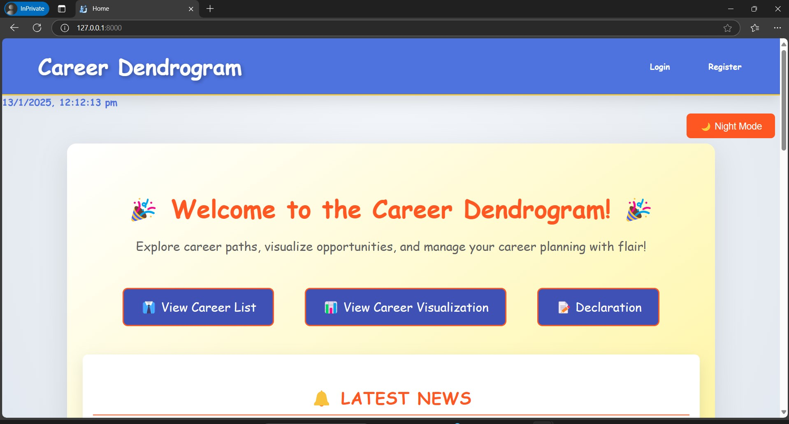
- **Middle Part**
  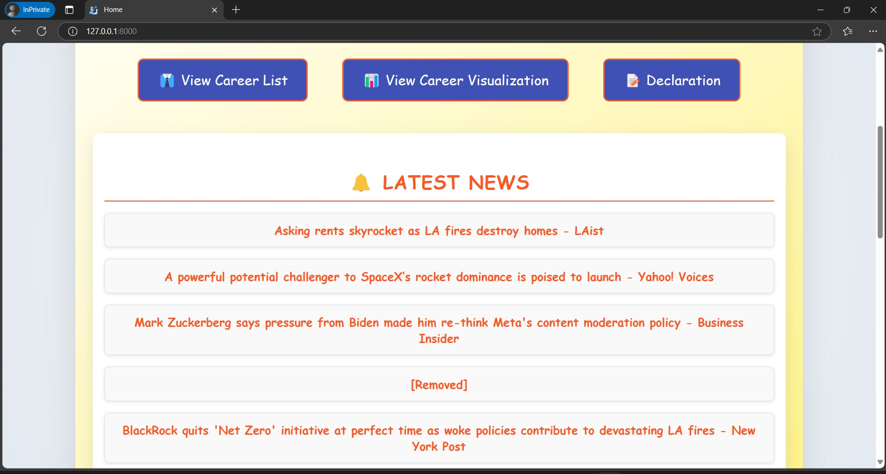
- **Bottom Part**
  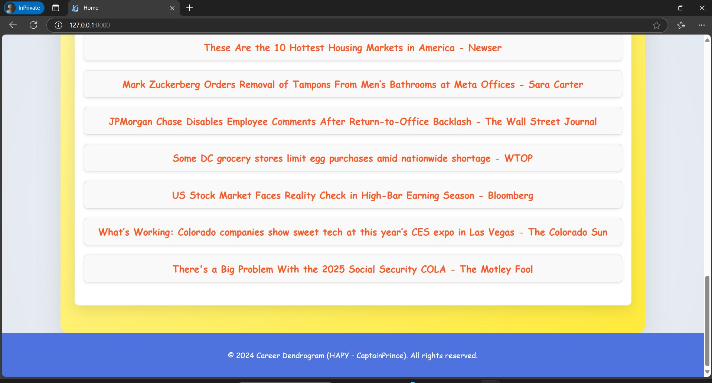

### 2. User Registration Page
- **Top Part**
  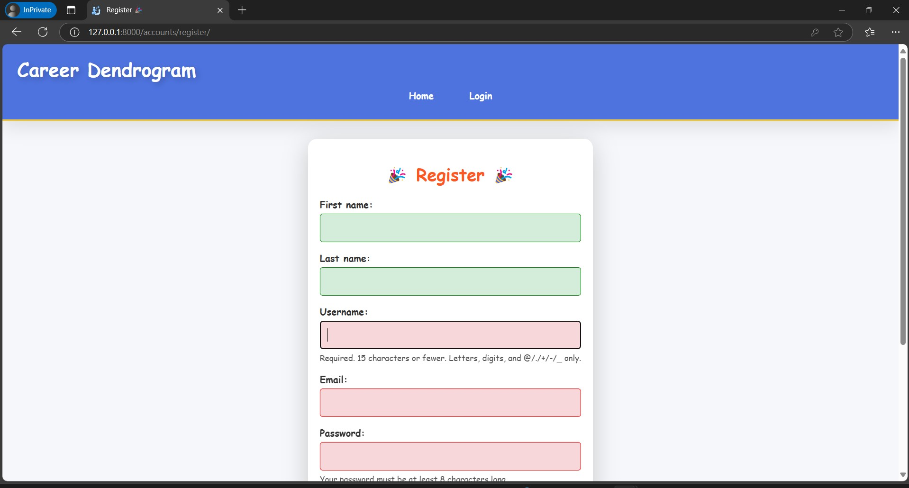
- **Bottom Part**
  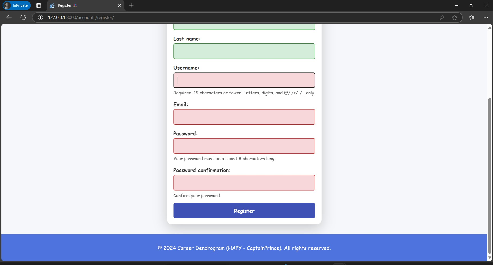

### 3. Login Page
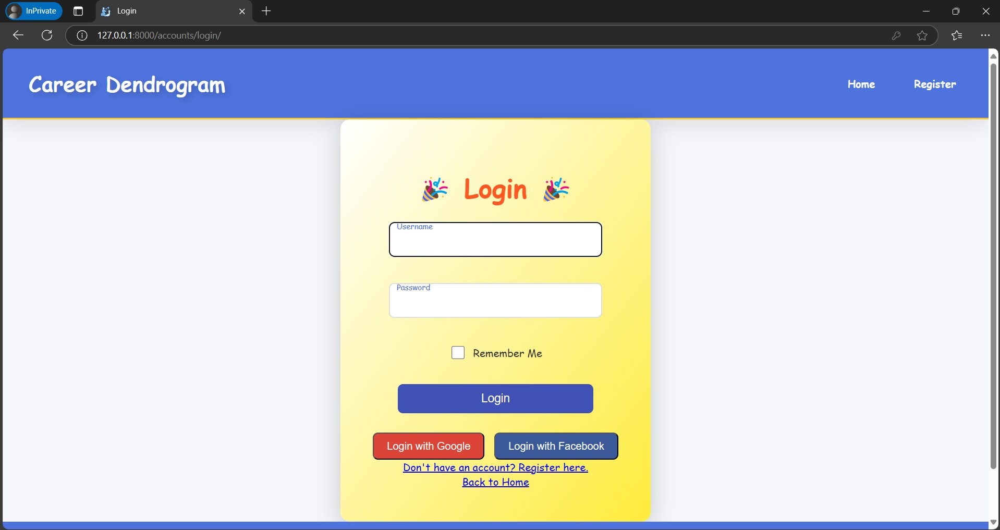

### 4. User Dashboard
- **Home Page After User Login**
  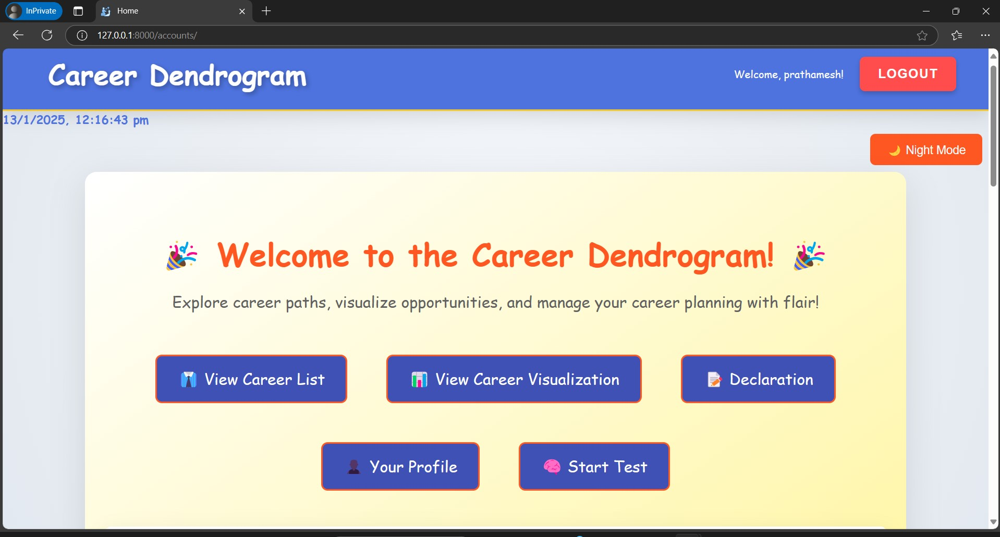

### 5. Profile Page
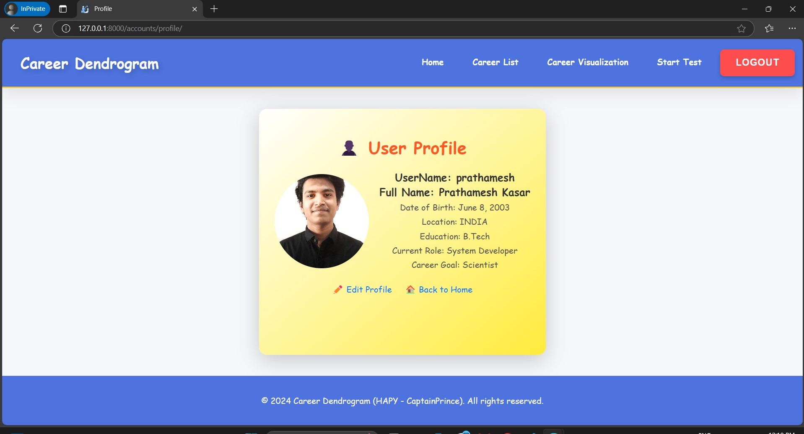

### 6. Test Question Pages
- **Top Part**
  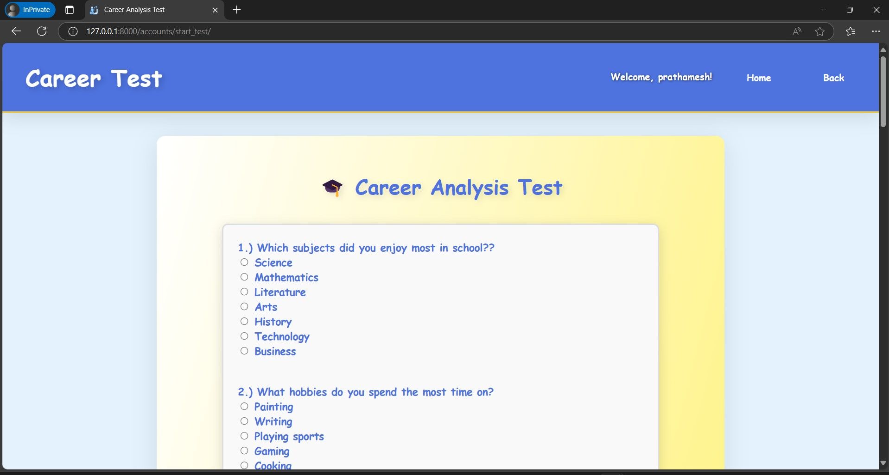
- **Bottom Part**
  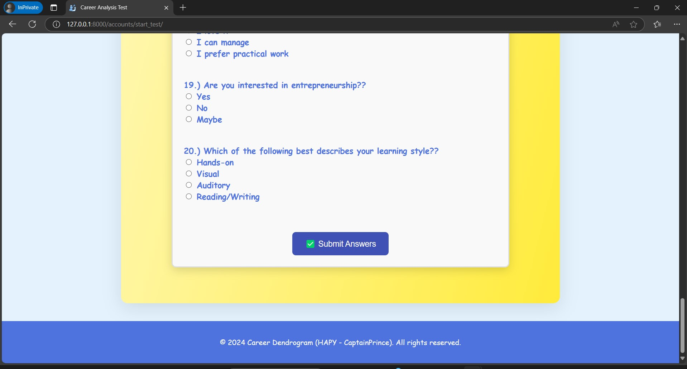

### 7. Test Result Pages
- **Top Part**
  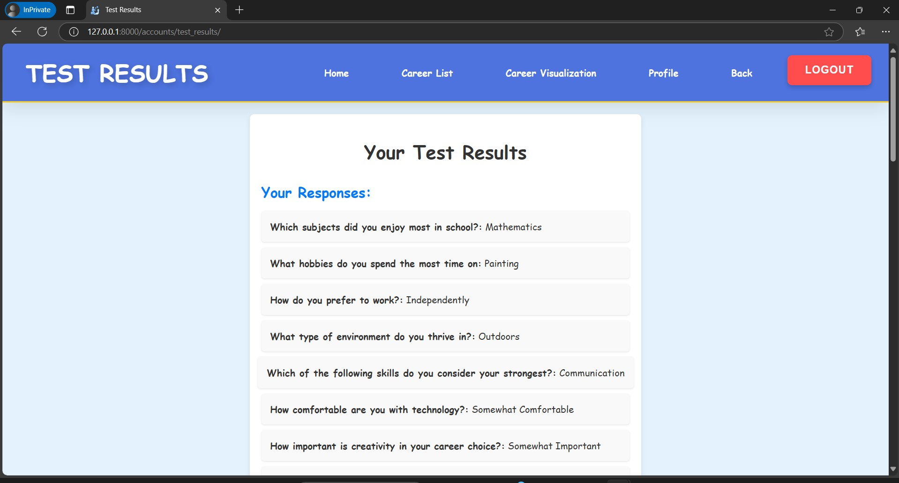
- **Bottom Part**
  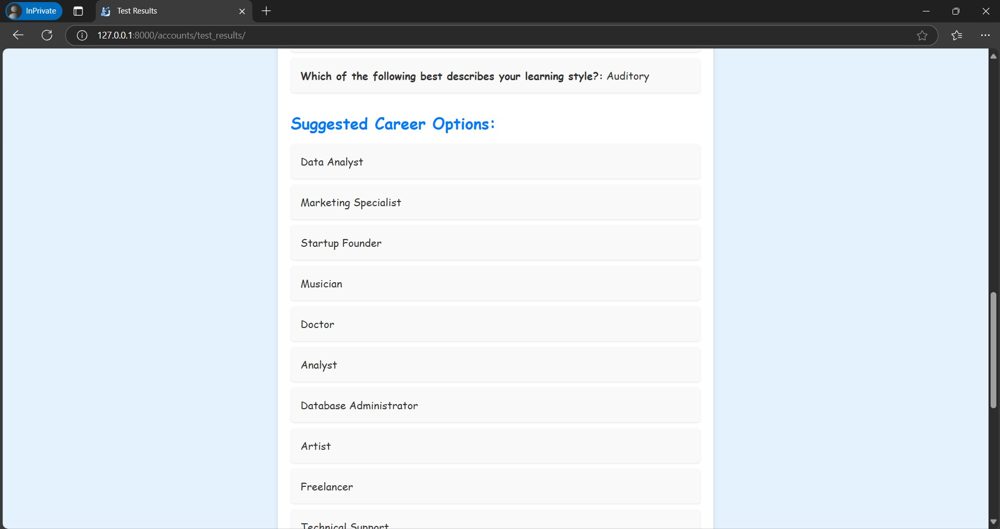

### 8. Career Dendrogram Visualization
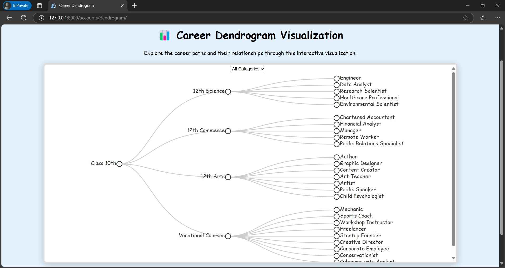

### 9. Career Description Page
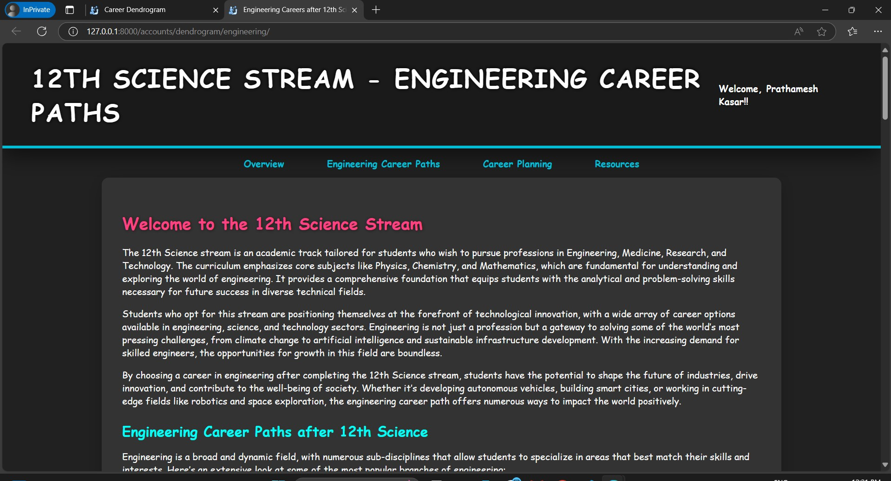

### 10. Admin Pages
- **Login Page**
  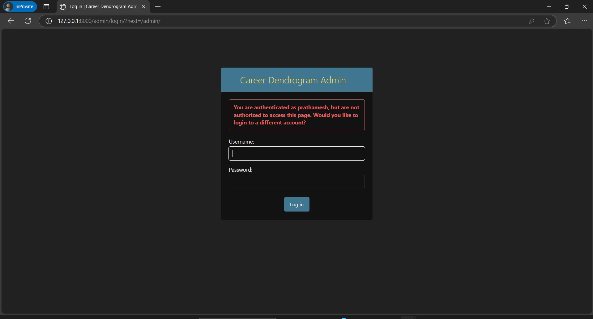
- **Home Page**
  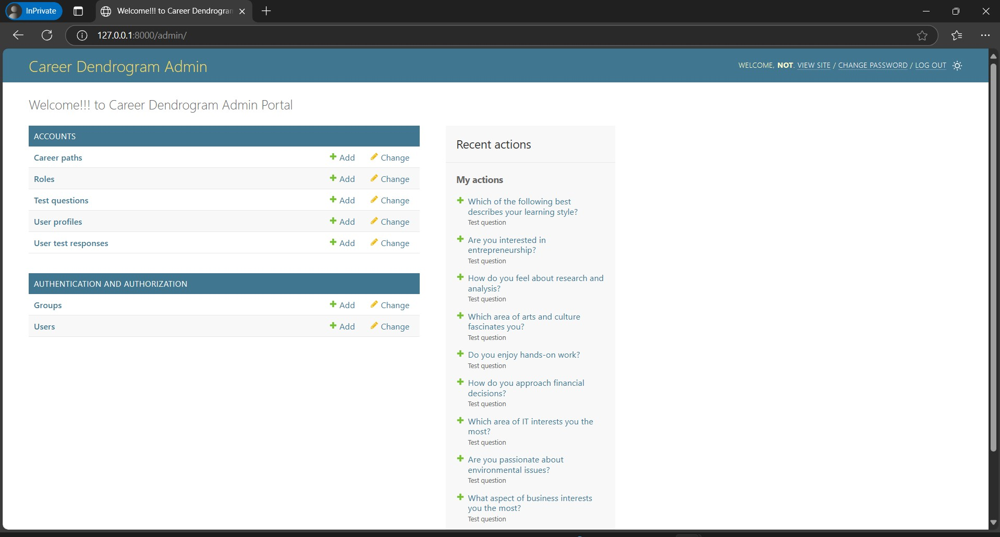
- **Update Questions Page**
  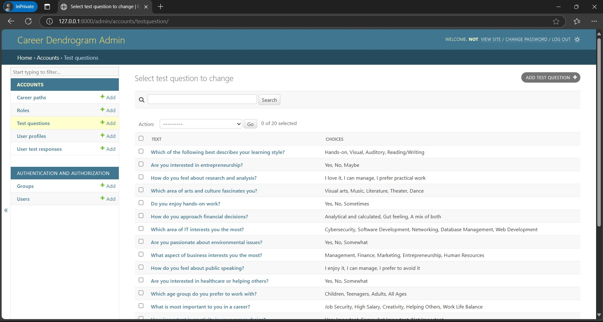
- **Update Users Page**
  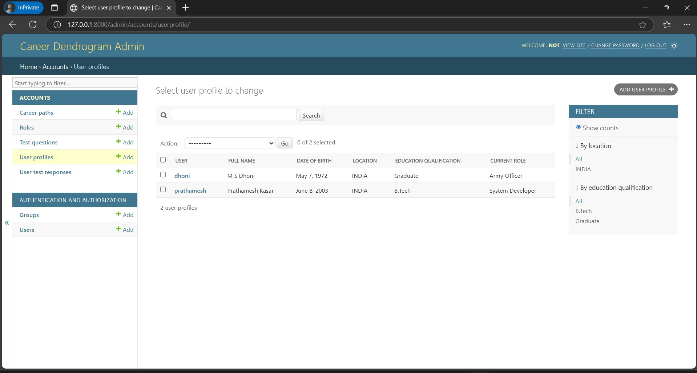
